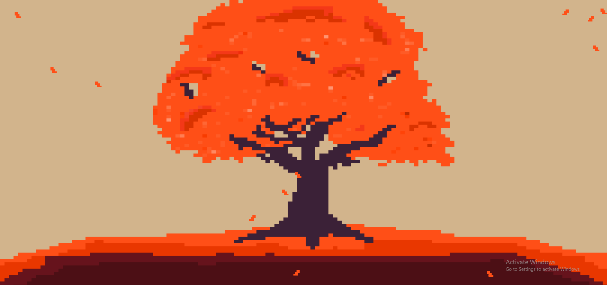

# Autumn-Paper
A website that has randomly falling leaves and is heavily aesthetic and works with lively wallpaper.
### Why did I make Autumn-Paper?
- I use a wallpaper software called lively that supports websites as a source and wanted to make my own wallpaper and thought it would be a fun project to continue my JS skills.
- I have always seen those awesome wallpaper engine ones but as I have the FOSS version which while awesome doesn't come preset with a diverse shop like walpaper engine fueled by the community. They often have animated elements like flowers from cherry blossoms and I wanted to do a pixel art version of these to build upon my skills.

### Important
- I also understand it's not particularly impresive but I had exams so no time for siege this week, so meceneraies covered the hours this week lol. 
- This was a 6hr project and my JS skills still suck lol.
- I have no clue why it took me this long I got a working prototype pretty quickly. 
- The tree is my own pixel art (ASK PERMISSION IF YOU WANT TO USE IT)[OPEN AN ISSUE]
### Screenshot 

### Demo Instructions:
NOTE THAT THIS WAS  CODED AROUND 1080P resolution and may not be amazing on other resolutions
- Simply visit the website - [Link](https://riley-d-1.github.io/Autumn-Paper/)
- That's it! (It doesn't work well on some resolutions but should work on most)
- Click if you want more leaves to fall

Alternatively you can also use lively and add the wallpaper to experience it in your own way. In Lively wallpaper click the add wallpaper button and paste the website link https://riley-d-1.github.io/Autumn-Paper/, give it your own title and it will work automatically. 
(Clicks dont work on the lively version for some reason.)
### Problems
- The leaves stop at the tree (yeh well its the same colour and they look silly blending in so it's "breeze" stops to wait)
-  It was designed for 1080p so while it was updated to work on most resolutions
- Clicks don't work in lively (if you do use this as a wallpaper)
## Credit
There is an inspiration folder that I used to help stylise the tree but the tree is my own work. Massive thanks to those artists to inspiring my own art.

### BIG SHOUTOUT TO LIVELY WALLPAPER FOR THE WHOLE REASON THIS IS POSSIBLE

